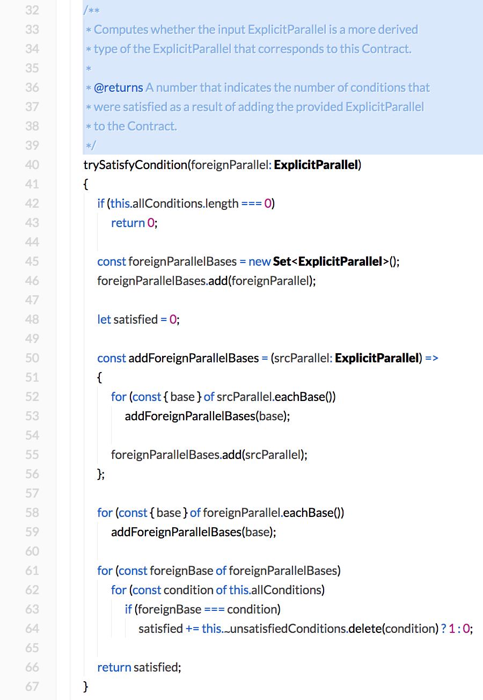

# Laco Font

The _Laco_ font ("Lato, but for Code") is a derivation of [Lato](https://fonts.google.com/specimen/Lato) by Łukasz Dziedzic. It alters some of the glyphs in order to make the font suitable for displaying source code, using a beautiful, easy-to-read and space-optimizing proportionally spaced font.

As of [February 2020](https://github.com/microsoft/vscode/issues/87479), the great team behind Visual Studio Code (specifically the Monaco editor) has fixed the editor's previous inability to word wrap proportionally-spaced fonts.

## Enabling in Visual Studio Code

In order to enable proper word wrapping of proportionally-spaced fonts in Visual Studio Code, go into your Preferences (`Menu bar > Visual Studio Code > Preferences > Settings`), search for the **Editor: Wrapping Strategy** setting, and set it to **advanced**.

## Visual Examples

---

## Notable Changes From Lato

- The notoriously hideous underscores are now replaced with a slightly more palatable *under wave*.
- There is a strong visual differentiation between the grave (back tick), double quote, and single quote characters, so this kind of code: `"''"`  becomes readable.
- The `{` and `}` brace characters are expanded.
- The asterisk is made larger, and centered within the character box.

## Typefaces

Laco comes in Regular, Italic, Bold, and Bold Italic. Laco's Bold typeface is actually Lato's Black typeface. This is because most editors (Visual Studio Code) only support the display of two separate fonts weights in the editor, and the font strives to maximize visual differentiation where possible.

## Originals

This repository contains `.glyphs` files, suitable for being loaded into [Glyphs](https://glyphsapp.com/), a commercial macOS-based font design program. The generated `.woff`, `.woff2`, and `.otf` font files are in the `/build` directory.